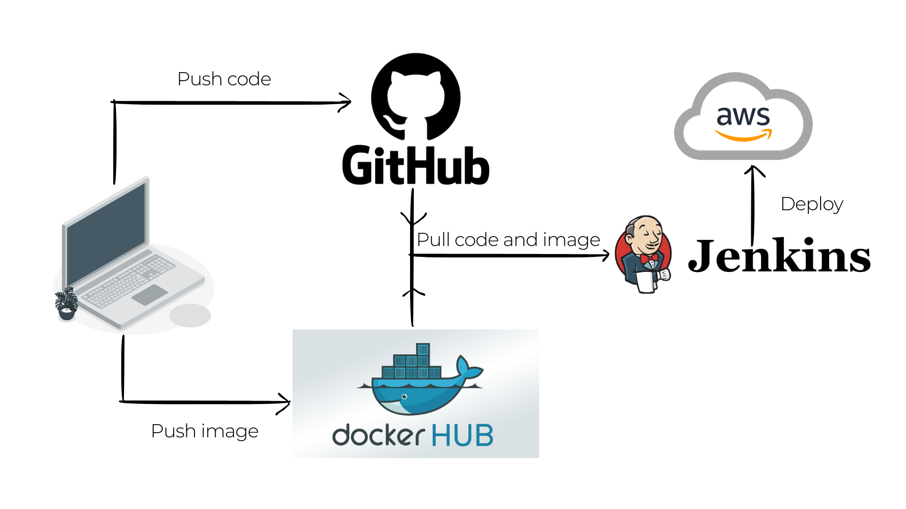

# **SHOP MANAGEMENT API SERVER - DEVOPS ASSIGNMENT**

## **A. INTRODUCTION**

A simple API server to manage a shop. 
Technologies and Frameworks:
- **Backend**: NodeJS - Express
- **Database**: MongoDB  
- **CI/CD**: Jenkins, Docker
- **Deployment**: AWS

---

## **B. Project structure**

```plaintext
./
├── server/                 # Backend Server
│   ├── index.js            # Entry point backend
│   ├── package-lock.json
│   ├── package.json        # Dependencies
│   ├── Dockerfile          # Docker config for backend
│   ├── .gitignore 
│
├── docker-compose.yml      # Docker Compose configuration
│
└── Jenkinsfile             # Jenkins configuration
```
---
## **C. Jenkins configuration**

1. **Environment Variables**  
   - `DOCKER_IMAGE` and `DOCKER_TAG` are used to define the Docker image name and tag for the backend application.  
   - `PROD_SERVER` and `PROD_USER` are set for connecting to the production server.  
   - `TELEGRAM_BOT_TOKEN` and `TELEGRAM_CHAT_ID` are used to send build status notifications via Telegram.

2. **Pipeline Stages**  
   - **Clone Repository:** Clones the source code from the `master` branch of the GitHub repository.  
   - **Build Docker Image:** Builds the Docker image for the backend application, specifying the platform as `linux/amd64`.  
   - **Run Tests:** Executes tests to ensure code quality before deployment.  
   - **Push to Docker Hub:** Pushes the Docker image to Docker Hub using authentication credentials.
   - **Deploy to PROD:**  
     - Removes old containers and images on the production server.  
     - Pulls the latest Docker image.  
     - Creates a `prod` Docker network if it doesn’t exist.  
     - Runs the backend container and MongoDB container within the `prod` network.  

3. **MongoDB Integration**  
   - MongoDB is deployed as a Docker container in the production environment.  
   - It runs within the same Docker network (`prod`) as the backend container for seamless communication.  

4. **Notification System**  
   - Telegram API is integrated to send real-time build notifications (success or failure) to a specified chat.

5. **Workspace Cleanup**  
   - Ensures the workspace is cleaned up after every pipeline execution using `cleanWs()`.

6. **Key Features**  
   - Efficient Docker image management.  
   - Automated container lifecycle management for development and production environments.  
   - Supports robust CI/CD practices with clear notifications and workspace maintenance.

---  
### **D. CI/CD Pipeline**  


---

### **E. Telegram Notification Integration**  
- Sends build success or failure notifications via the Telegram API.  
- Automatically alerts the development team if the pipeline encounters errors.   
 
---

## **F. How to start the server**

### **1. Using Docker Compose**

1. **Run Docker Compose:**
   ```bash
   docker-compose up
   ```

2. **Enter to server:**
   - URL: [http://localhost:8000](http://localhost:8000)  

---

### **2. By Terminal**

#### **Start Server:**
```bash
cd server
node index.js
```

URL: [http://localhost:8000](http://localhost:8000)  


## **G. API Endpoints**

| Method | Endpoint         | Description          |
|--------|------------------|----------------------|
| GET    | /api/v1/products | Get product's list   |
| POST   | /api/v1/products | Create a new product |

